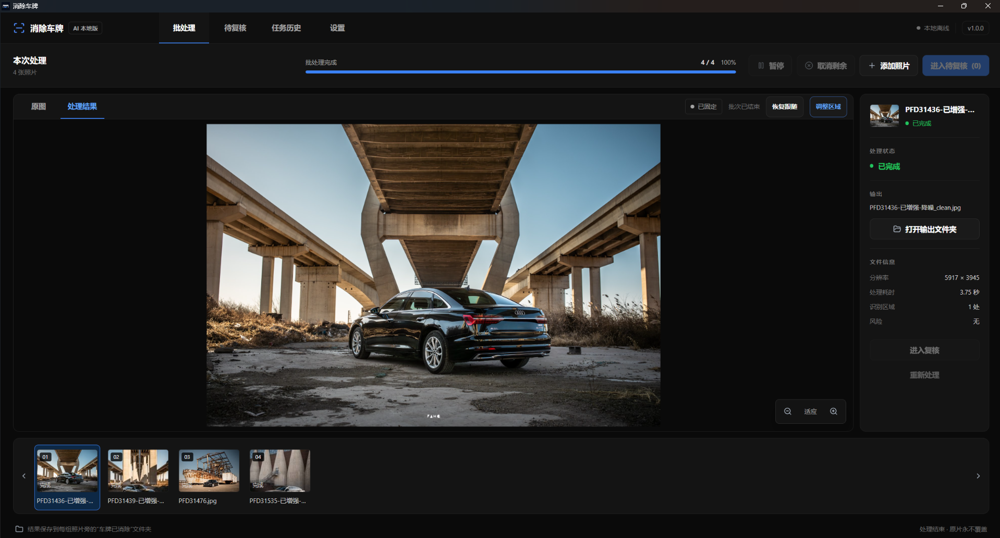

# Remove Number Plate

面向汽车摄影师的离线批量车牌消除工具。拖入图片或文件夹后，软件会自动检测车辆与车牌、沿车牌透视轮廓生成遮罩，并使用 LaMa 修复车身纹理。



- 不需要训练模型；
- 图片不会离开电脑；
- 支持 JPEG、PNG 与 TIFF；
- 保留安全的 EXIF、ICC 与 DPI 元数据；
- 输出到源目录旁的 `车牌已消除` 文件夹，绝不覆盖原图；
- 每张处理后的照片都可以进入四点透视调整，低置信度照片仍会集中进入待复核区。

## 轻量桌面界面

桌面端使用系统 WebView2 与本地 HTML/CSS/JavaScript，不包含 Qt、Electron 或独立 Chromium。检测和修复统一使用 ONNX Runtime，因此不要求用户安装 CUDA、cuDNN 或 Python。

开发环境启动：

```powershell
python run.py
```

界面包含批处理、待复核、任务历史和设置四个分栏。批处理页以单张大图为中心：

- “原图 / 处理结果”分栏切换，不并排挤压照片；
- 底部胶片带快速浏览整批照片，100 张以上仍使用窗口化渲染；
- 自动跟随当前处理项，也可固定查看任意照片；
- 预览支持适应窗口、1:1、缩放和平移；
- 1040×680 最小窗口和 200% 缩放下保留核心操作。

主预览中的每张非处理中照片都有“调整区域”入口。编辑器支持四点透视框、35% 默认
边缘范围（可在 -30% 到 +100% 间调整并在设置中保存）、新增/删除车牌框、画笔、橡皮擦、撤销和
重做。临时结果只写本机缓存；确认保存后才生成 `_clean_2`、`_clean_3` 等新文件。

## 开发环境

已验证环境为 Windows 10/11 与 Python 3.11：

```powershell
python -m venv .venv
.\.venv\Scripts\python.exe -m pip install -r requirements-dev.txt
```

模型不提交到普通 Git 历史；版本、来源与 SHA-256 固定在 `models/manifest.json`。
发布模型可以在隔离的 Paddle 3.0/Paddle2ONNX 2.1 环境中从官方源归档重建：

```powershell
python -m scripts.build_models
python -m scripts.verify_models
```

## 开发者批处理命令

```powershell
python -m app.cli process "D:\客户A\成片"
python -m app.cli resume
python -m app.cli report
```

## Windows 打包

日常开发测试无需安装或卸载：

```powershell
.\packaging\build_preview.ps1
.\启动测试版.cmd
```

固定测试版位于 `dist\preview`，重复构建后仍使用同一个启动入口。

仅在候选版通过样片验收后构建安装程序：

```powershell
.\packaging\build_release.ps1
```

脚本会校验模型、运行测试、构建免安装目录与正式安装程序，并执行桌面启动验收。
最终文件位于 `dist\installer`，同目录包含 SHA-256 校验值。

带 `v*` tag 的 GitHub 发布必须配置代码签名证书；缺少签名 secrets 时流水线会拒绝
发布。手动运行 workflow 可以生成明确标记的未签名内部预览。

## 用户文档

- [项目技术与宣传介绍](项目技术介绍.md)
- [模型说明](docs/models.md)
- [用户指南](docs/user-guide.md)
- [故障排除](docs/troubleshooting.md)
- [隐私说明](docs/privacy.md)
- [发布检查清单](docs/release-checklist.md)
- [候选版发布说明](RELEASE.md)

## 故障诊断

如果应用无法启动或处理失败，可在“设置 → 诊断与支持”导出 ZIP 诊断包。诊断包只含
版本、运行环境、任务数量和轮转日志，不包含照片、文件路径或任务数据库。

## 许可与版权

本项目为源码公开（source-available）的**非商用许可**项目，完整条款见 [LICENSE](LICENSE) 文件。

- 版权归 Dian Fang（方典）所有，著作权人对本项目保留完整、排他的权利；
- 允许**查看、学习、个人及非商业用途**的使用与修改；
- **禁止任何商业用途**、未经书面许可的再分发以及闭源商用；
- 任何被允许的复制、传播或修改均须保留版权声明与许可协议原文。

注意：本许可不属于 OSI 认证的"开源"许可。本项目引用的第三方开源组件仍受其各自
原始许可及 [THIRD_PARTY_NOTICES.md](THIRD_PARTY_NOTICES.md) 约束。如需商业授权
或其他合作，请通过 [GitHub Issues](https://github.com/SARSfang/RemoveNumberPlate/issues)
联系著作权人另行协商。
