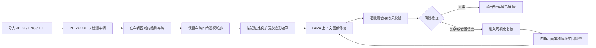

# 消除车牌：面向汽车摄影师的离线 AI 批量修图工具

> 拖入整组照片，自动识别车辆与车牌，沿真实透视轮廓生成遮罩，并通过 AI
> 重建被车牌遮挡的车身纹理。无需训练模型、无需上传照片、无需订阅云服务。

## 一句话介绍

**消除车牌**是一款为汽车摄影工作流设计的 Windows 本地工具。它不是给车牌打码或
模糊，而是自动定位车牌区域，再使用图像修复模型重建该区域，让照片更适合交付、
作品展示和社交媒体发布。

当前版本：`v0.2.0-rc.7`

## 为什么开发这个项目

汽车摄影师一次拍摄往往会产生几十到数百张照片。传统处理方式需要逐张打开图片、
框选车牌、扩展选区、生成填充、检查边缘，再另存文件。这个过程机械、重复，而且
不同拍摄角度下的车牌并不是标准水平矩形，简单选区很容易误伤格栅、保险杠、镀铬
饰条和车漆反光。

本项目希望把这套流程压缩为：

1. 拖入照片或文件夹。
2. 软件自动完成检测、遮罩和 AI 修复。
3. 摄影师快速浏览结果，只调整少量复杂照片。
4. 输出安全地写入独立文件夹，原片始终保留。

## 核心技术流程



## 用了哪些方法

### 1. 车辆优先的两阶段目标检测

项目没有直接在整张高分辨率照片上盲目搜索小车牌，而是采用两阶段检测：

1. 使用 **PP-YOLOE-S** 定位照片中的车辆。
2. 在每个车辆区域内，使用基于 **PP-OCRv3 DB** 的车牌检测模型继续定位车牌。

这种方法先缩小搜索范围，再检测尺寸较小的车牌区域，有助于减少背景文字、路牌和
其他高对比物体的干扰。

两个检测模型均来自 Paddle 官方推理模型，通过 **Paddle2ONNX 2.1.0** 转换为
**ONNX opset 14**，转换过程不涉及重新训练。最终软件通过 **ONNX Runtime**
在本地执行推理，因此用户不需要安装 Paddle、Python、CUDA 或开发环境。

### 2. 四点透视车牌轮廓

斜拍、低机位和广角构图中的车牌通常是梯形，而不是水平矩形。本项目端到端保存
检测器输出的四个角点，并使用顺时针凸四边形表示车牌：

```text
左上点 → 右上点 → 右下点 → 左下点
```

后端会校验四点数量、坐标、顺序、凸性、面积和自交情况。旧版本保存的矩形任务仍
可自动回退为四角矩形，因此数据库升级不会破坏历史任务。

与普通矩形遮罩相比，透视四边形更贴合真实车牌边缘，能减少对保险杠、格栅和车漆
区域的无效覆盖。

### 3. 基于短边比例的多边形边缘扩展

只覆盖车牌文字通常不够，车牌框、固定螺丝和边缘反光也需要进入修复区域。项目使用
**Pyclipper 多边形偏移**扩展四边形，而不是简单地把矩形向上下左右放大。

扩展距离按车牌四边形的平均短边计算：

```text
扩展距离 = 车牌短边 × 边缘扩展比例
```

- 默认值：`+35%`
- 可调范围：`-30% ～ +100%`
- 调整步进：`1%`
- 可在设置中修改并永久保存

多边形使用圆角连接方式扩展，再通过 OpenCV `fillPoly` 生成全分辨率二值遮罩。
这样既能覆盖车牌边框，也能继续保持透视方向。

### 4. LaMa AI 图像修复

遮罩生成后，项目使用 **OpenCV 发布的量化 LaMa ONNX 模型**进行图像修复。
LaMa 属于大遮罩图像修复方法，目标不是复制附近某一块像素，而是根据周围结构与
纹理推断遮罩区域应该呈现的内容。

当前实现还加入了针对汽车照片的工程处理：

- 只截取遮罩周围的正方形上下文区域，避免整张高分辨率照片无意义缩放。
- 上下文范围默认约为遮罩尺寸的 4 倍，并保证至少 64 像素。
- 将上下文送入 512 × 512 的 LaMa 模型进行推理。
- 把生成结果缩放回原始分辨率后，仅合成到对应上下文区域。
- 使用高斯羽化和内部实心核心混合，减弱修复区域边缘的接缝感。

因此，软件执行的是“检测区域后的内容重建”，不是马赛克、模糊、纯色覆盖或简单
的内容感知克隆。

### 5. 自动风险分流

自动化不等于盲目保存。程序会检查检测结果是否存在以下风险：

- 置信度低于自动处理阈值。
- 车牌尺寸过小。
- 检测区域接触照片边缘。
- 长宽比或面积异常。
- 多个检测框高度重叠。

风险照片会进入“待复核”，避免不可靠结果直接混入交付文件。与此同时，每张非
处理中的照片都保留“调整区域”入口，即使系统没有自动判定风险，摄影师也可以主动
微调。

### 6. Human-in-the-loop 可视化复核

项目保留了摄影师最终决定权。复核编辑器支持：

- 独立拖动四个角点。
- 整体移动透视框。
- 新增或删除多个车牌区域。
- 画笔补充遮罩。
- 橡皮擦移除误选区域。
- 撤销与重做。
- 调整单张照片的边缘扩展。
- 调整遮罩透明度并切换原图、遮罩和临时结果。

编辑后先生成本地临时预览，只有确认满意才保存正式结果。继续编辑会使旧预览失效，
避免误保存过期结果。临时预览使用随机令牌与当前任务绑定，默认 30 分钟后失效。

### 7. 原片保护与安全输出

对摄影项目而言，保护原片和色彩信息与修复效果同样重要：

- 自动应用 EXIF 方向，避免横竖图坐标错位。
- 保留安全 EXIF、ICC 色彩配置、DPI 信息。
- JPEG 尽量沿用原量化表与色度抽样设置。
- 结果写入源目录旁的 `车牌已消除` 文件夹。
- 使用 `_clean`、`_clean_2`、`_clean_3` 自动生成新版本。
- 永不覆盖原图或已有结果。
- 先写入临时文件，完成解码和尺寸校验后再原子重命名。

即使写入中断，也不会把半成品当成正式结果。

## 为什么不需要用户训练模型

软件集成的是已经训练完成的推理模型。开发阶段只做了模型格式转换和工程适配：

```text
Paddle 官方推理模型 → Paddle2ONNX → ONNX Runtime 本地推理
```

用户不需要：

- 准备或标注车牌数据集。
- 学习机器学习训练流程。
- 安装 Python、Paddle 或 CUDA。
- 购买云 GPU。
- 配置任何 API Key。

模型文件随候选版一起校验，版本、来源和 SHA-256 固定在
[`models/manifest.json`](models/manifest.json) 中。文件缺失或校验不一致时，软件
会阻止处理，而不是使用未知模型继续运行。

## 轻量桌面架构

界面没有使用 Qt 或 Electron，而是采用：

| 层级 | 技术 |
|---|---|
| 桌面容器 | pywebview + Windows WebView2 |
| 界面 | 本地 HTML、CSS、JavaScript |
| 核心逻辑 | Python 3.11 |
| 模型推理 | ONNX Runtime CPU |
| 图像与几何 | OpenCV、NumPy、Pillow、Pyclipper |
| 任务记录 | SQLite |
| Windows 打包 | PyInstaller + Inno Setup |

WebView2 复用 Windows 系统运行时，不随软件打包一套独立 Chromium。相比 Electron
方案，运行架构更适合单一用途的本地摄影工具。当前推理路径固定使用 CPU
Execution Provider，因此没有独立显卡也可以运行。

界面分为批处理、待复核、任务历史和设置四个区域，支持高 DPI、最小窗口和
200% Windows 缩放。照片胶片带采用窗口化渲染，大批量任务不会把所有缩略图同时
放入页面。

## 完全本地的隐私设计

照片、检测结果、遮罩和临时预览均在用户电脑上处理。运行时不需要账号，也没有
上传图片的 API。

界面内容安全策略明确设置：

```text
connect-src 'none'
```

这会禁止界面脚本发起网络连接。诊断包也不会包含照片、完整文件路径、任务数据库
或临时预览，只记录版本、运行环境和必要日志。

## 工程可靠性

当前 RC7 候选版已通过：

- Python 自动测试：141 项通过。
- 前端状态与交互测试：13 项通过。
- Ruff 静态规范检查。
- Mypy 类型检查。
- JavaScript 语法检查。
- Windows 免安装版构建与真实桌面启动冒烟测试。
- 1280 × 820、1040 × 680、744 × 530 高缩放等效视口检查。

任务数据库具有版本迁移、完整性检查和损坏隔离机制；用户设置采用临时文件替换，
无效设置会先备份再恢复默认值。

## 项目亮点

1. **面向汽车摄影场景**：不是通用打码工具，而是针对车牌透视、车身纹理和批量
   交付流程设计。
2. **真正消除而非遮挡**：使用 LaMa 重建区域内容，不是模糊或马赛克。
3. **透视感知遮罩**：四点轮廓贯穿检测、数据库、编辑器和最终修复。
4. **全自动与可控并存**：大部分照片自动完成，复杂照片有完整人工调整入口。
5. **无需训练和付费接口**：预训练模型本地推理，没有按张计费。
6. **隐私优先**：原片不上传，运行时界面禁止网络连接。
7. **保护摄影文件**：不覆盖原图，保留关键元数据，写入前验证结果。
8. **轻量桌面体验**：WebView2 本地界面，不包含 Qt、Electron 或独立 Chromium。

## 适用场景

- 汽车商业摄影批量交付。
- 二手车、租赁和经销商车辆图片整理。
- 汽车活动、赛道日和车友聚会照片发布。
- 个人汽车作品集及社交媒体发布前处理。
- 对照片隐私和本地处理有要求的工作室。

## 当前边界

- 当前直接支持 JPEG、PNG、TIFF，不直接读取 CR3、NEF、ARW 等 RAW。
- 极端反光、严重遮挡、过小车牌或复杂格栅仍可能需要人工调整。
- 当前候选版尚未使用商业代码签名证书，Windows 可能显示信誉提示。
- 正式商业发行前仍需完成更大规模商拍样片验收、模型权重条款法律复核和代码签名。
- 本项目的目标是摄影后期处理，不用于识别、记录或追踪车牌号码。

## 可直接使用的宣传文案

### 30 字短介绍

面向汽车摄影师的离线 AI 车牌消除工具，批量拖入、本地修复、原片不上传。

### 社交媒体版

拍完一组汽车照片，还在逐张框选车牌吗？

“消除车牌”会先识别车辆，再沿车牌的真实透视轮廓生成遮罩，使用 LaMa AI 重建
车身纹理。整套流程完全在 Windows 本地运行，无需训练、无需云端 API，也不会上传
原片。自动结果不满意时，还可以拖动四角、调整边缘、使用画笔和橡皮擦重新生成。

不是马赛克，而是为汽车摄影工作流设计的批量 AI 修图工具。

### 项目主页版

**让摄影师把时间留给拍摄，而不是重复框选车牌。**

消除车牌是一款完全离线的 Windows 汽车摄影工具。它通过两阶段目标检测定位车辆与
车牌，保留四点透视轮廓，生成可调节的多边形遮罩，再使用 LaMa 完成局部内容重建。
软件支持批量处理、风险复核、逐张调整、历史任务和安全版本化输出。无需训练模型、
无需上传照片、无需订阅服务。

## 延伸资料

- [项目说明](README.md)
- [RC7 发布说明](RELEASE.md)
- [用户指南](docs/user-guide.md)
- [隐私说明](docs/privacy.md)
- [第三方组件与模型说明](THIRD_PARTY_NOTICES.md)
- [RC7 上线前界面审计](docs/audits/v0.2.0-rc.7/launch-ui-audit.md)
